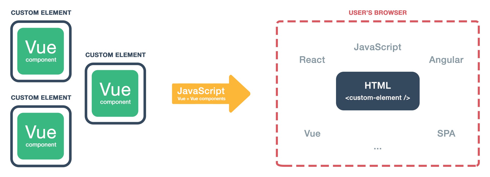

# Frameworkless vue components

How to reuse vue components in another frameworks 💻

## Web components

Web Components is a suite of different technologies allowing you to create reusable 
custom elements, with their functionality encapsulated away from the rest of your code
and utilize them in your web apps:

```html
<this-is-my-element foo="bar"><this-is-my-element>
```

Most frameworks implement their own components approach.

The only framework that compiles to native web components is [Polymer](https://www.polymer-project.org/).


## vue-custom-element

[vue-custom-element](https://github.com/karol-f/vue-custom-element) is a tiny wrapper around Vue components



With it you can use vue components wherever you want 💃

## Requirements   

All the demos use webpack.
If your're not using webpack you can read the [vue-custom-element docs](https://github.com/karol-f/vue-custom-element)

- webpack
- vue
- vue-custom-element 
- vue-loader
- vue-style-loader
- vue-template-compiler
- css-loader
- sass-loader
- node-sass

## Demos

There's one demo for each of this frameworks

### React 

```bash
cd react
npm install
node server.js
```

### Vanilla

```bash
cd vanilla
npm install
npm start
```

### Backbone

```bash
cd backbone
yarn install
yarn dev
```